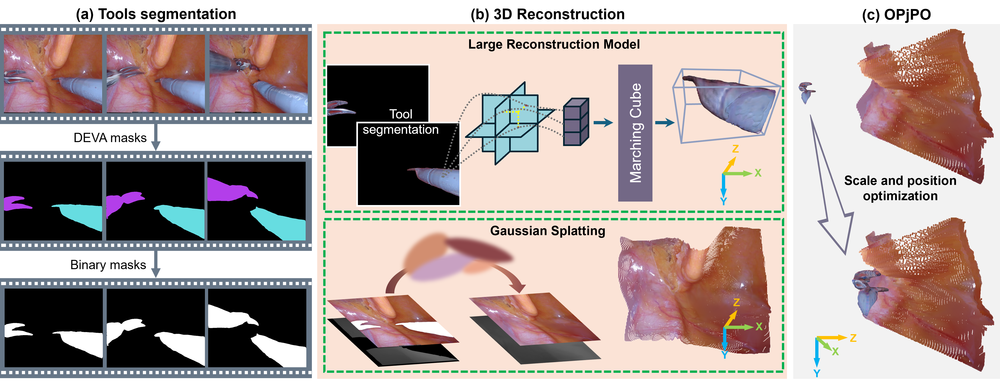

# EndoLRMGS

Abstract: Complete reconstruction of surgical scenes is crucial for robot-assisted surgery (RAS). Deep depth estimation is promising but existing works struggle with depth discontinuities, resulting in noisy predictions at object boundaries and do not achieve complete reconstruction omitting occluded surfaces. 
To address these issues we propose EndoLRMGS, that combines Large Reconstruction Modelling (LRM) and Gaussian Splatting (GS), for complete surgical scene reconstruction. GS reconstructs deformable tissues and LRM generates 3D models for surgical tools while position and scale are subsequently optimized by introducing orthogonal perspective joint projection optimization (OPjPO) to enhance accuracy.

## Architecture



## Prerequisites
- Python 3.10
- CUDA-compatible GPU

## Installation

```bash
# Clone the repository
git clone https://github.com/your-username/EndoLRMGS.git
cd EndoLRMGS

# Setup submodules
cd ./EndoGaussian
wget https://github.com/CUHK-AIM-Group/EndoGaussian/tree/master/submodules
git submodule update --init --recursive

# Create and setup Python environment
conda create -n EndoGaussian python=3.10
conda activate EndoGaussian

# Install dependencies
pip install -r requirements.txt
pip install -e submodules/depth-diff-gaussian-rasterization
pip install -e submodules/simple-knn
```

## Dataset Structure
Follow [DEVA](https://github.com/hkchengrex/Tracking-Anything-with-DEVA.git) to prepare the required annotations and binary masks.

Example dataset structure:
```tree
endonerf/               # Root directory
├── pulling/
│   ├── Annotations/    # Surgical instruments color masks
│   ├── binary_mask_deva/ # Surgical instruments binary masks
│   ├── depth/         # Depth maps
│   └── images/        # Left rectified images
├── cutting_tissues_twice/
├── scared/
└── stereomis/
```

## Usage

### Inference

For EndoNerf pulling dataset:
```bash
python -m openlrm.launch infer.lrm \
    --infer ./configs/infer-b-endonerf-pulling.yaml \
    --model_name zxhezexin/openlrm-mix-base-1.1 \
    --image_input /workspace/dataset/endolrm_dataset/endonerf/pulling/images \
    --export_mesh false \
    --gaussian_config /workspace/EndoLRM2/EndoGaussian/arguments/endonerf/pulling.py
```

For EndoNerf cutting dataset:
```bash
python -m openlrm.launch infer.lrm \
    --infer ./configs/infer-b-endonerf-cutting.yaml \
    --model_name zxhezexin/openlrm-mix-base-1.1 \
    --image_input /workspace/dataset/endolrm_dataset/endonerf/cutting_tissues_twice/images \
    --export_mesh false \
    --gaussian_config /workspace/EndoLRM2/EndoGaussian/arguments/endonerf/cutting_tissues_twice.py
```

For Stereomis dataset:
```bash
python -m openlrm.launch infer.lrm \
    --infer ./configs/infer-b-stereomis.yaml \
    --model_name zxhezexin/openlrm-mix-base-1.1 \
    --image_input /workspace/dataset/endolrm_dataset/stereomis/left_finalpass \
    --export_mesh false \
    --gaussian_config /workspace/EndoLRM2/EndoGaussian/arguments/stereomis/stereomis.py
```

For Scared dataset:
```bash
python -m openlrm.launch infer.lrm \
    --infer ./configs/infer-b-scared.yaml \
    --model_name zxhezexin/openlrm-mix-base-1.1 \
    --image_input /workspace/dataset/endolrm_dataset/scared/dataset_6/data/left_finalpass \
    --export_mesh false \
    --gaussian_config /workspace/EndoLRM2/EndoGaussian/arguments/scared/d6k4.py
```

### Training

For EndoNerf pulling dataset:
```bash
accelerate launch --config_file ./configs/accelerate-train.yaml \
    -m openlrm.launch train.lrm \
    --config ./configs/train-sample.yaml \
    --no-freeze_endo_gaussian \
    --gaussian_config /workspace/EndoLRM2/EndoGaussian/arguments/endonerf/pulling.py
```

For EndoNerf cutting dataset:
```bash
accelerate launch --config_file ./configs/accelerate-train.yaml \
    -m openlrm.launch train.lrm \
    --config ./configs/train-sample.yaml \
    --no-freeze_endo_gaussian \
    --gaussian_config /workspace/EndoLRM2/EndoGaussian/arguments/endonerf/cutting_tissues_twice.py
```

For Stereomis dataset:
```bash
accelerate launch --config_file ./configs/accelerate-train.yaml \
    -m openlrm.launch train.lrm \
    --config ./configs/train-sample.yaml \
    --no-freeze_endo_gaussian \
    --gaussian_config /workspace/EndoLRM2/EndoGaussian/arguments/stereomis/stereomis.py
```

For Scared dataset:
```bash
accelerate launch --config_file ./configs/accelerate-train.yaml \
    -m openlrm.launch train.lrm \
    --config ./configs/train-sample.yaml \
    --no-freeze_endo_gaussian \
    --gaussian_config /workspace/EndoLRM2/EndoGaussian/arguments/scared/d6k4.py
```

## Acknowledgements

This project builds upon the following works:
- [EndoGaussian](https://github.com/CUHK-AIM-Group/EndoGaussian.git)
- [LRM](https://yiconghong.me/LRM/)
- [OpenLRM](https://github.com/3DTopia/OpenLRM.git)
- [DEVA](https://github.com/hkchengrex/Tracking-Anything-with-DEVA.git)
