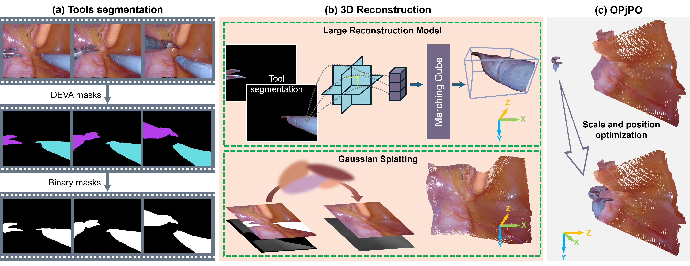

# EndoLRMGS

### [📄 arXiv Paper](https://arxiv.org/abs/2503.22437)

## 📝 Abstract

Complete reconstruction of surgical scenes is crucial for robot-assisted surgery (RAS). Deep depth estimation is promising but existing works struggle with depth discontinuities, resulting in noisy predictions at object boundaries and do not achieve complete reconstruction omitting occluded surfaces. 

To address these issues we propose **EndoLRMGS**, that combines **Large Reconstruction Modelling (LRM)** and **Gaussian Splatting (GS)**, for complete surgical scene reconstruction. GS reconstructs deformable tissues and LRM generates 3D models for surgical tools while position and scale are subsequently optimized by introducing **orthogonal perspective joint projection optimization (OPjPO)** to enhance accuracy.

## 🏗️ Architecture



## 📋 Table of Contents

- [Prerequisites](#prerequisites)
- [Installation](#installation)
- [Dataset Preparation](#dataset-preparation)
- [Usage](#usage)
  - [Inference](#inference)
  - [Training](#training)
  - [Evaluation](#evaluation)
- [Visualization](#visualization)
- [Citation](#citation)
- [Acknowledgements](#acknowledgements)

## 🔧 Prerequisites

- Python 3.10
- CUDA 12.1 compatible GPU (tested on NVIDIA RTX A6000)
- Docker (recommended)
- Conda or Miniconda

## 📦 Installation

```bash
# Clone the repository
git clone https://github.com/your-username/EndoLRMGS.git
cd EndoLRMGS

# Create and activate Python environment
conda create -n endolrmgs python=3.10
conda activate endolrmgs

# Install PyTorch with CUDA 12.1 support
pip install torch==2.5.1 torchvision==0.20.1 --index-url https://download.pytorch.org/whl/cu121

# Install project dependencies
pip install -r requirements.txt

# Install Gaussian Splatting submodules
cd FMGaussianSplatting
pip install submodules/depth-diff-gaussian-rasterization
pip install submodules/simple-knn
cd ..

# If you encountered error, like "ModuleNotFoundError: No module named 'torch'",
# please try this : pip install submodules/depth-diff-gaussian-rasterization --no-build-isolation
```

## 📂 Dataset Preparation

### 1. Download Datasets

Download the required surgical datasets:
- [EndoNeRF Dataset](https://github.com/med-air/EndoNeRF)
- [SCARED Dataset](https://endovissub2019-scared.grand-challenge.org/)
- [StereoMIS Dataset](https://www.synapse.org/#!Synapse:syn25101790)

### 2. Prepare Annotations

Follow [DEVA](https://github.com/hkchengrex/Tracking-Anything-with-DEVA.git) to generate the required annotations and binary masks for surgical instruments. Use text-prompted : 
```bash
python demo/demo_with_text.py --chunk_size 4 --img_path ./stereomis/p2_6/left_finalpass --amp --temporal_setting semionline --size 480 --output ./output/stereomis/p2_6 --prompt instruments.tools
```

### 3. Dataset Structure

Organize your dataset with the following structure:
```tree
endonerf/               # Root directory
├── pulling/
│   ├── Annotations/    # Surgical instruments color masks
│   ├── binary_mask_deva/ # Surgical instruments binary masks
│   ├── depth/         # Depth maps
│   └── images/        # Left rectified images
├── cutting_tissues_twice/
├── scared/
└── stereomis/
```

## 🚀 Usage

### Inference

For EndoNerf pulling dataset:
```bash
python -m openlrm.launch infer.lrm \
    --infer ./configs/infer-b-endonerf-pulling.yaml \
    --model_name zxhezexin/openlrm-mix-base-1.1 \
    --image_input /workspace/dataset/endolrm_dataset/endonerf/pulling/images \
    --export_mesh true \
    --gaussian_config ./FMGaussianSplatting/arguments/endonerf/pulling.py
```

For EndoNerf cutting dataset:
```bash
python -m openlrm.launch infer.lrm \
    --infer ./configs/infer-b-endonerf-cutting.yaml \
    --model_name zxhezexin/openlrm-mix-base-1.1 \
    --image_input /workspace/dataset/endolrm_dataset/endonerf/cutting_tissues_twice/images \
    --export_mesh true \
    --gaussian_config ./FMGaussianSplatting/arguments/endonerf/cutting.py
```

For Stereomis dataset:
```bash
python -m openlrm.launch infer.lrm \
    --infer ./configs/infer-b-stereomis.yaml \
    --model_name zxhezexin/openlrm-mix-base-1.1 \
    --image_input /workspace/datasets/endolrm_dataset/stereomis/p2_6/left_finalpass \
    --export_mesh true \
    --gaussian_config ./FMGaussianSplatting/arguments/stereomis/stereomis_2_6.py
```

For Scared dataset:
```bash
python -m openlrm.launch infer.lrm \
    --infer ./configs/infer-b-scared.yaml \
    --model_name zxhezexin/openlrm-mix-base-1.1 \
    --image_input /workspace/dataset/endolrm_dataset/scared/dataset_6/data/left_finalpass \
    --export_mesh true \
    --gaussian_config ./FMGaussianSplatting/arguments/scared/d6k4.py
```

### Training
To access LRM pretrained model "model.safetensors", please refer to https://huggingface.co/zxhezexin/openlrm-mix-small-1.1/tree/main and save the model in EndoLRMGS/checkpoint/mix-small
For EndoNerf pulling dataset:
```bash
accelerate launch --config_file ./configs/accelerate-train.yaml \
    -m openlrm.launch train.lrm \
    --config ./configs/train-sample.yaml \
    --no-freeze_gaussian \
    --gaussian_config ./FMGaussianSplatting/arguments/endonerf/pulling.py
```

For EndoNerf cutting dataset:
```bash
accelerate launch --config_file ./configs/accelerate-train.yaml \
    -m openlrm.launch train.lrm \
    --config ./configs/train-sample.yaml \
    --no-freeze_gaussian \
    --gaussian_config ./FMGaussianSplatting/arguments/endonerf/cutting.py
```

For Stereomis dataset:
```bash
accelerate launch --config_file ./configs/accelerate-train.yaml \
    -m openlrm.launch train.lrm \
    --config ./configs/train-sample.yaml \
    --no-freeze_gaussian \
    --gaussian_config ./FMGaussianSplatting/arguments/stereomis/stereomis_2_6.py
```

For Scared dataset:
```bash
accelerate launch --config_file ./configs/accelerate-train.yaml \
    -m openlrm.launch train.lrm \
    --config ./configs/train-sample.yaml \
    --no-freeze_gaussian \
    --gaussian_config ./FMGaussianSplatting/arguments/scared/d6k4.py
```

### Evaluation
To evaluate the reconstructed tissues and surgical instruments, use the following scripts:

#### Evaluate tissues
```bash
python ./evaluation/metrics.py
```

#### Evaluate surgical instruments
```bash
python postprocess_sequences_stereomis.py
python ./evaluation/tools_reprojection_loss.py
```

## 🔍 Visualization

### To generate a spinning point cloud
Please refer to another repo: https://github.com/MichaelWangGo/3D_spinning_visualization.git

## 📑 Citation

If you find this repository useful for your research, please consider citing our work:

```
@article{your_article_id,
  title={EndoLRMGS: Complete Endoscopic Scene Reconstruction combining Large Reconstruction Modelling and Gaussian Splatting},
  author={Xu Wang},
  journal={arXiv preprint arXiv:2503.22437},
  year={2025}
}
```

## 🙏 Acknowledgements

This project builds upon the following works:
- [EndoGaussian](https://github.com/CUHK-AIM-Group/EndoGaussian.git)
- [Deformable-3D-Gaussians](https://github.com/ingra14m/Deformable-3D-Gaussians)
- [Mip-Splatting](https://github.com/autonomousvision/mip-splatting.git)
- [LRM](https://yiconghong.me/LRM/)
- [OpenLRM](https://github.com/3DTopia/OpenLRM.git)
- [DEVA](https://github.com/hkchengrex/Tracking-Anything-with-DEVA.git)
